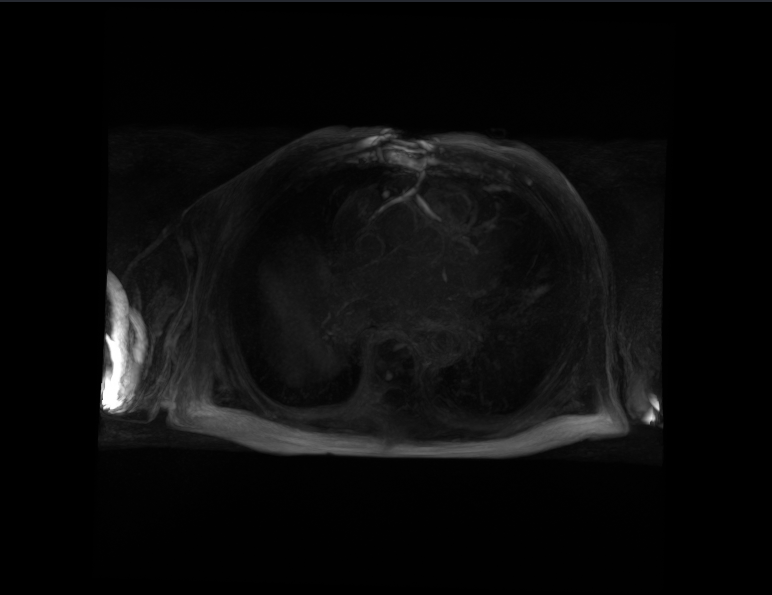

# Medical image segmentation
### Dataset
1. 2018 left atrial cavity segmentation: https://www.cardiacatlas.org/atriaseg2018-challenge/atria-seg-data/
2. Pancreas CT dataset: https://www.cancerimagingarchive.net/collection/pancreas-ct/ 

### Visualization Left Atrial

| MRI Raw                           | LA Cavity Segmentation             | True LA Cavity                       |
|-----------------------------------|------------------------------------|-------------------------------------|
|       |  |  |
