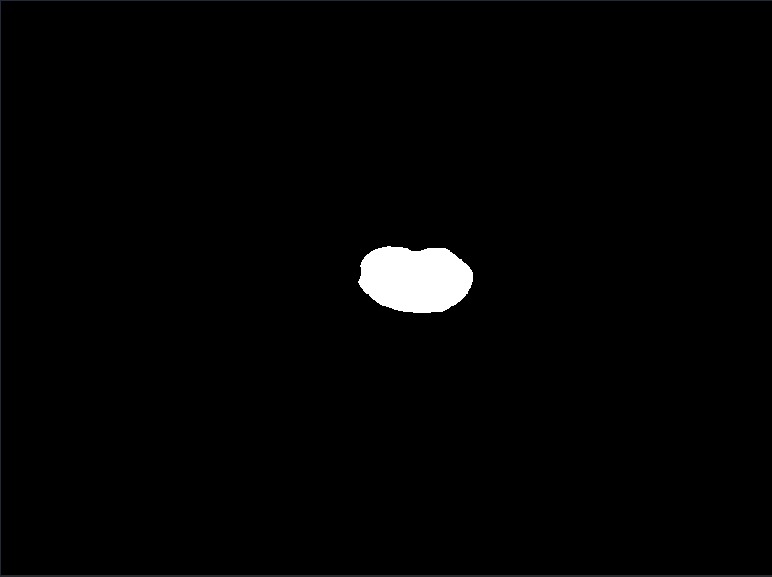

# Medical image segmentation
### Dataset
1. 2018 left atrial cavity segmentation: https://www.cardiacatlas.org/atriaseg2018-challenge/atria-seg-data/
2. Pancreas CT dataset: https://www.cancerimagingarchive.net/collection/pancreas-ct/ 

### Visualization
For visualization, I use the library napary: https://napari.org/stable/
1. MRI raw

2. LA cavity segmentation

3. True LA cavity
